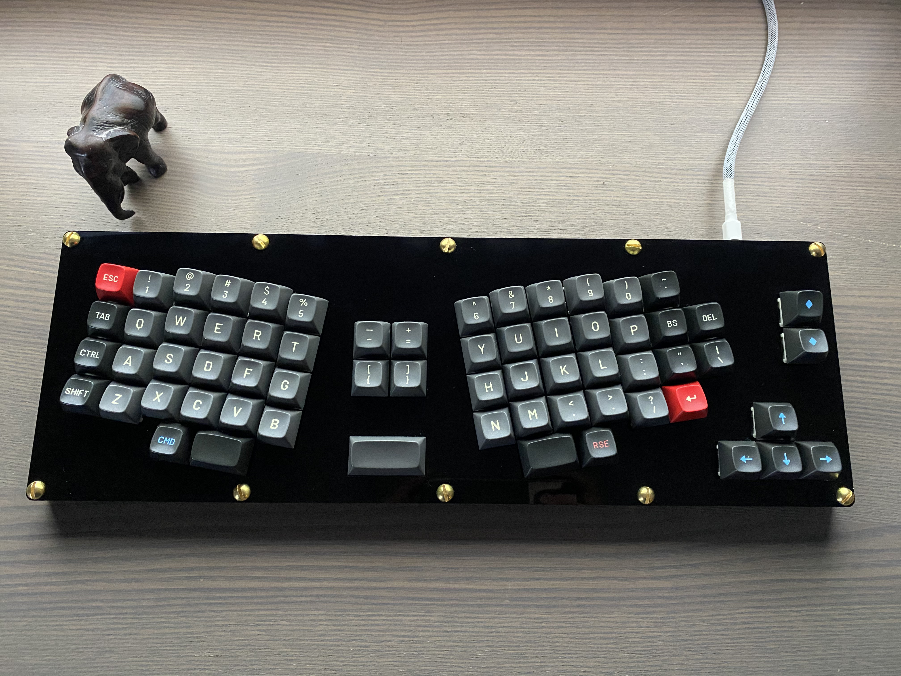
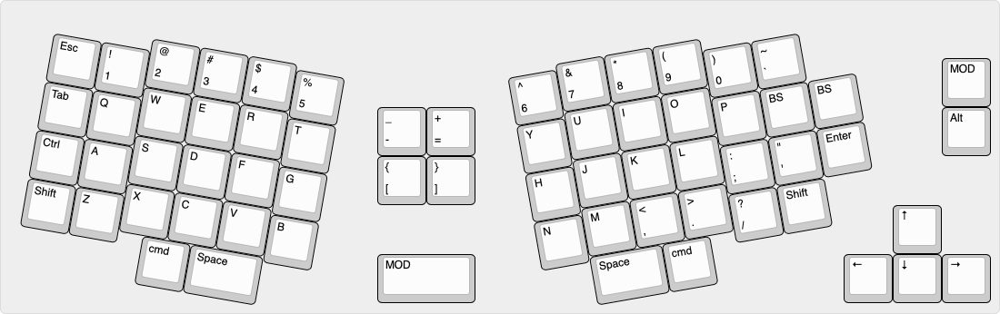
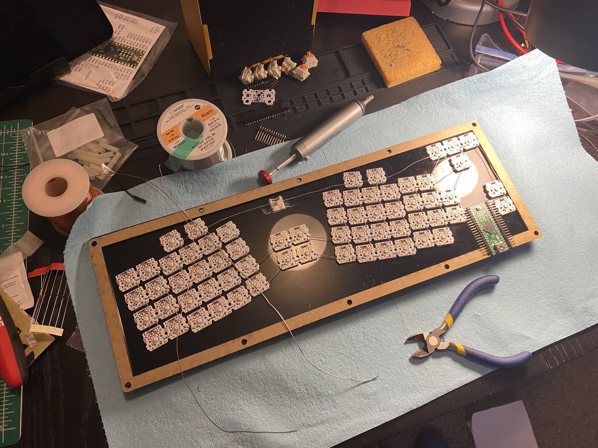
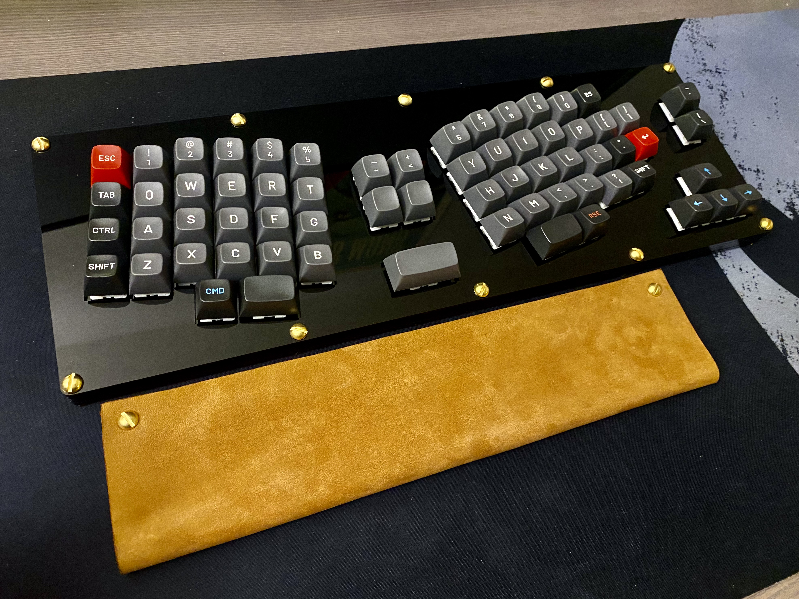

# Franky65

Custom design 65% ortholinear mechanical keyboard

## Specs

- case: acrylic (4&deg; angle)
- switch: glorious panda (67 g)
- keycaps: Drop MT3 Susuwatari
- PCB: Amoeba Single-Switch PCBs + handwired
- controller: teensy 2.0 ++
- weight: ~ 500 grams
- cable: Zap cables DIY kit
- wrist rest: tool leather (and leftover acrylic pieces)
- stabilizer: Durock

## Layout

After building and using [Lily58](https://github.com/kata0510/Lily58), I enjoyed the ortholinear (column-staggered) profile and the ability to type without excessive hand movement. I want a one-piece keyboard, yet the common trend among the hobbyists is 60% or less. So I decided to design and build a keyboard that tailors to my typing habit (typing angle, distance, and layout) and the Susuwatari keycaps options. The result is Franky65 (shoutout to Eiichiro Oda), a 65% keyboard that embraces the ortholinear layout. 

The layout can be found [here](http://www.keyboard-layout-editor.com/#/gists/9a9c36858d611d99c76e028af32bc170). The two sides maintain a 10&deg; angle, which fits nicely with my hand positions. 

## Case

Again going against the trend, I want a keyboard that looks and feels "monstrous". The black and gold theme and the classic Susuwatari keycap colorway add a bit of vintage look. The board is laser cut by [Ponoko](https://www.ponoko.com/start), and the screws are 10-32 brass. The case is sandwished mount, with five 3 mm acrylic pieces at the front and additional two 3 mm pieces in the back to create a 4&deg; angle. I found it to type very nicely with the high profile keycaps (MT3). The designs are included in the `case_design` folder. The keyboard is designed to be low profile (keycaps sides uncovered, use more top layers for higher profiles).

## PCB & Controller & Wiring

To have a key matrix with 65 keys, the minimum column and row number are 8 x 9, which needs 17 pins. To avoid wiring complications, teensy 2.0 ++ is used because it comes with an abundance of pins (44). The downside is the mini USB connection, which is thicker than 3 mm. An extra slot was cut from the middle plate to fit the vertical tolerance. Amoeba single switch PCBs are used because my initial thought was to add a bit more rigidity to keys. However, I would prefer handiwring for space-saving. The space between the PCB and the switches is wasteful. Here a photo before the controller is wired to the matrix (please ignore the messy workstation):

## Miscellaneous

Lastly, I wanted to add a custom cable to make the keyboard stand out. The cable is from zap cables DIY [kit](https://zapcables.com/diy-usb-cable-kit/), black braided sleeve and white techflex sleave, and white heat sink. The wrist rest is made with spare acrylic pieces from Ponoko glued with a piece of tool leather. Two 10-32 screws are added to give a slight angle to the wrist rest and match the aesthetics of the Franky65.

## QMK

The QMK configurations and the default keymap are included in the `franky65` folder. After setting up QMK build environment, Franky65 can be compiled:

	make franky65:default

See the [build environment setup](https://docs.qmk.fm/#/getting_started_build_tools) and the [make instructions](https://docs.qmk.fm/#/getting_started_make_guide) for more information for QMK.
